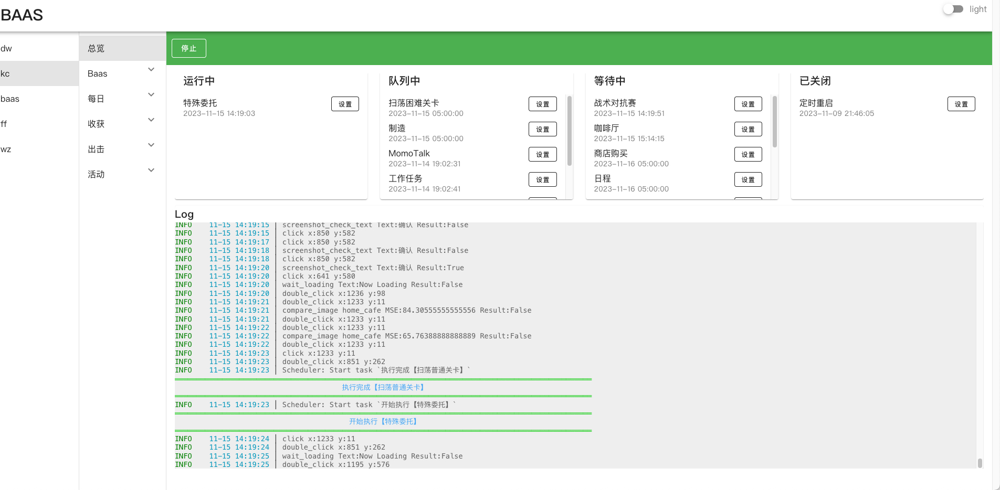

# Blue Archive Auto Script

## QQ交流群

- QQ交流1群: 621628600(已满)
- QQ交流2群: 441327580(已满)
- QQ交流3群: 190361986

## 提交PR要求

### 屎山代码别沾边 😊😊😊

### 运行截图



## 更新日志

### 即将更新
- ### 新增功能
  - [x] **添加一键启动参数** 可以配合Windows实现一键启动或开机启动Baas
  - [x] **每天自动删除好友** 国服专供 卷起来，爆金币
  - [x] **日程** 重构日程功能，只需要选择扫荡次数，不需要选具体关卡
  - [x] **Momotalk** 优化互动点击
- ### Bug修复
  - [x] **日程** 修复国服日程红冬学院bug
  - [x] **咖啡厅** 修复咖啡厅误触导致卡识别bug
  - [x] **Momotalk** 修复误触导致点击超出momotalk弹框bug
  - [x] **Momotalk** 优化互动点击
  - [x] **困难开图** 修复9-2卡宝石bug
  - [x] **特殊委托** 修复国服第10关报错bug
  - [x] **竞技场** 修复日服竞技场UI修改


### 2024-2-29
- ### 国服
    - [x] **修女与魔法师** 活动开图和扫荡

### 2024-2-22
- ### Baas
    - [x] **UI更新** 更新UI更快操作 
    - [x] **内存优化** 网页UI更加流畅 
- ### 日服
    - [x] **UI更新** 兼容2月21号 UI更新
- ### 国服
    - [x] **庆典大骚动** 活动开图和扫荡
### 2024-2-1

- ### 三服通用
    - [x] **普通开图** 支持6-17图全自动一键开图
    - [x] **困难开图** 支持6-17图全自动一键开图
    - [x] **困难挑战** 支持6-17图全自动挑战任务
    - [x] **UI更新** 更方便管理每个任务状态
    - [x] **修复BUG** 修复若干BUG

### 2024-1-19

- ### 三服通用
    - [x] **困难挑战** 支持6-16图挑战任务
    - [x] **UI** 任务功能排序优化
    - [x] **退出游戏设置** 当没有任务时退出游戏节约内存
    - [x] **主线剧情** 日服国际服支持剧情
    - [x] **日程** 修复日程票识别bug
    - [x] **学园交流会** 没门票bug
- ### 国服
    - [x] **制造** 代码重构 防止卡识别
    - [x] **新春活动** 活动开图和扫荡
    - [x] **学园交流会** 扫荡
- ### 日服
    - [x] **咖啡厅** 二号厅互动

### 2024-1-4

- ### 国服
    - [x] **温泉活动** 全自动开图&扫荡功能
    - [x] **制造** 代码重构 防止卡识别

### 2024-1-1

- ### 三服通用
    - [x] **普通开图** 重录开图数据,支持6-16图
    - [x] **困难开图** 重录开图数据,重构6-16图 三星路线和宝箱路线
    - [x] **咖啡厅** 新增邀请开关
    - [x] **咖啡厅** 邀请新增 邀请最低好感度和邀请最高好感度配置
    - [x] **通缉悬赏** Bug修复
    - [x] **商店购买** 重构
- ### 日服
    - [x] **咖啡厅** 修复邀请bug
    - [x] **日程** 修复日程票识别bug
    - [x] **商店购买** 新增常用商店和竞技场商店购买
    - [x] **学园交流会** 新增学园交流会扫荡功能
    - [x] **购买体力** 支持任意次数的体力购买，可立即执行关联任务
- ### 国际服
    - [x] **商店购买** 新增常用商店和竞技场商店购买
    - [x] **学园交流会** 新增学园交流会扫荡功能
    - [x] **购买体力** 支持任意次数的体力购买，可立即执行关联任务

### 2023-12-20
- ### 三服通用
    - [x] **自动保存功能**
- ### 国服
    - [x] **代码重构**
- ### 国际服 和 日服
    - [x] **小组** 自动打开小组，并签到
    - [x] **邮箱** 一键领取邮箱全部奖励
    - [x] **工作任务** 一键领取任务全部奖励
    - [x] **桃信** 自动完成所有未结束对话 完成剧情 领取青辉石
    - [x] **咖啡厅** 领体力 摸头好感 邀请学生
    - [x] **日程** 根据所配置的学校课程，一键完成全部内容
    - [x] **特别委托** 扫荡指定次数的任意委托任务
    - [x] **通缉悬赏** 根据配置的关卡自动扫荡
    - [x] **主线普通扫荡**：可指定任意主线关卡
    - [x] **主线困难扫荡**：可指定任意主线关卡
    - [x] **竞技场** 快速战斗，领取每日奖励
    - [x] **普通关卡-开图** 直接⭐️⭐️⭐️
    - [x] **困难关卡-开图** 直接⭐️⭐️⭐️

### 2023-12-09

- [x] **自动更新** 支持windows和macos启动器下载,以后版本直接在线更新
- [x] **配置文件迁移** 更新版本无需重新配置,迁移脚本会自动更新没有的任务
- [x] **调度** 任务关联添加活动
- [x] **日程** 添加崔尼蒂学院
- [x] **BugFix** 修复点击识别异常,OCR初始化失败

### 2023-12-08

- [x] **活动开图** 最新活动日奈会长故事和人物地图开图, 直接⭐️⭐️⭐️
- [x] **活动扫荡** 最新活动日奈会长任务图扫荡
- [x] **普通关卡-开图** 增加对`4,10-15`关卡支持, 直接⭐️⭐️⭐️
- [x] **困难关卡-开图** 新增对`7-10`关卡支持，直接⭐️⭐️⭐️
- [x] **咖啡厅** 增加全新礼物摸头方式，更加准确快捷
- [x] **反和谐** 修复部分用户反和谐失败
- [x] **性能优化** 运行更加流畅
- [x] **竞技场** 出击优化
- [x] **BugFix** 修复了网页白屏/启动就停止/特殊委托/等等Bug
- [x] **制造** 添加已有制造逻辑处理，添加是否使用加速券
- [x] **环境检查** 添加环境检查功能，一键解决设置问题
- [x] **UI** UI添加配置运行状态，多开状态更明显

### 2023-11-24

- [x] **普通关卡-开图** 一键开图，直接⭐️⭐️⭐️
- [x] **统计悬赏** I关支持
- [x] **反和谐** 一键反和谐
- [x] **性能优化** 运行更加流畅
- [x] **0依赖** 不依赖任何客户端直接下载双击运行

### 2023-11-20

- [x] **主线剧情** 自动完成所有主线剧情
- [x] **咖啡厅** 添加是否领取体力选项
- [x] **商店** 购买体力逻辑优化
- [x] **GUI** 配置文件排序
- [x] **商店** 修复竞技场货币不足bug

### 2023-11-17

- [x] **小组** 自动打开小组，并签到
- [x] **邮箱** 一键领取邮箱全部奖励
- [x] **工作任务** 一键领取任务全部奖励
- [x] **日程** 根据所配置的学校课程，一键完成全部内容
- [x] **咖啡厅**
    - [x] 领取咖啡厅收益奖励
    - [x] 邀请学生
    - [x] 每隔一段时间自动互动
    - [x] 学生互动(已实现精确点击)
    - [ ] 邀请指定学生
- [x] **商店** 支持商品全自定义购买
    - [x] 常规道具购买
    - [x] 对抗赛道具购买
    - [x] 刷新商店
- [x] **购买体力** 支持任意次数的体力购买，可立即执行关联任务
- [x] **主线普通扫荡**：可指定任意主线关卡
- [x] **主线困难扫荡**：可指定任意主线关卡
- [x] **特别委托** 扫荡指定次数的任意委托任务
- [x] **通缉悬赏** 根据配置的关卡自动扫荡（暂不支持开图）
- [x] **竞技场** 清理到没有竞技场挑战券为止 (可选等级比自己低的策略)
- [x] **桃信** 自动完成所有未结束对话 完成剧情 领取青辉石
- [x] **制造** 可选择制造物品优先级和制造次数
- [x] **账号多开** 同时运行多个自动化脚本控制多个账号
- [x] **GUI** 图形化界面控制所有功能和配置
- [x] **最新活动补习部签到** 最新活动补习部签到

### 待开发功能

- [ ] **支线剧情** 自动完成所有支线

### 支持平台

- Windows
- MacOS Intl，M1，M2芯片

### 如何运行

1. [点我下载](https://github.com/baas-pro/baas/releases)对应系统的文件，解压到目录（不要有中文路径）
2. 双击运行即可，首次打开时间较长请耐心等待(确保exe文件和configs文件在同一级目录中)
3. 运行成功后会自动打开[http://localhost:1117](http://localhost:1117)地址。根据网页说明进行配置即可

### 打包

For MAC

```bash
$ pyinstaller baas.spec
$ pyinstaller -F --name=baas --add-data 'assets:assets' --add-data 'web/static:web/static' --add-data 'web/templates:web/templates' --icon='assets/images/ba.ico' main.py
$ pyinstaller -w --name=baas --add-data 'assets:assets' --add-data 'web/static:web/static' --add-data 'web/templates:web/templates' --icon='assets/images/ba.icns' main.py
```

For Windows

```bash
$ pyinstaller baas.spec
$ pyinstaller --name=baas --add-data assets:assets --add-data web/static:web/static --add-data web/templates:web/templates --icon=assets/images/ba.ico main.py
```

### 启动器打包

For Mac

```bash
$ pyinstaller -F launcher.py --name Baas_Macos --icon='assets/images/common/ba.icns'
```

For Windows

```bash
$ pyinstaller -F launcher.py --name Baas_Windows --icon='assets/images/common/ba.ico'
```

### 赞助

